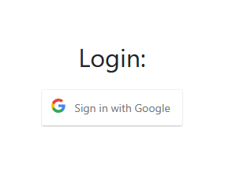
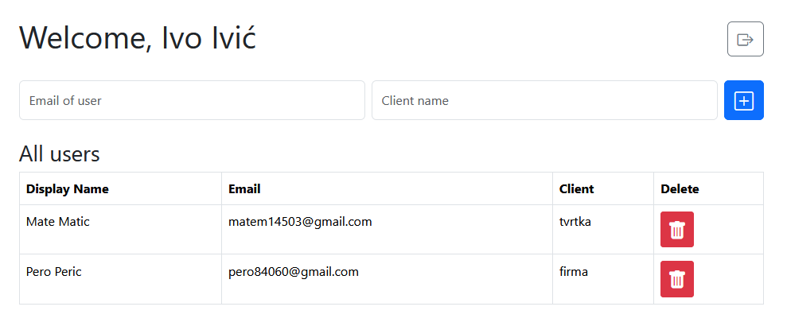
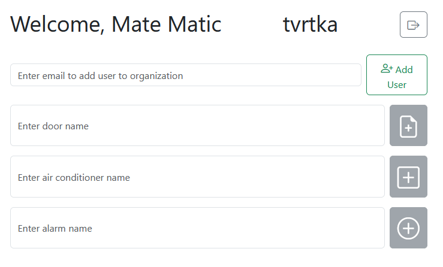
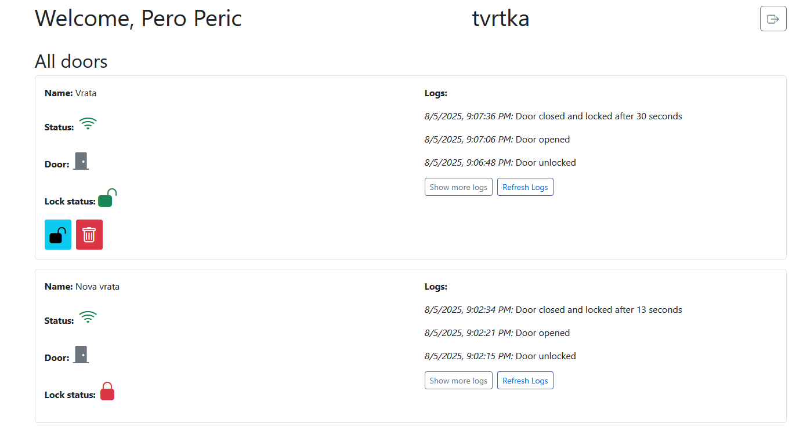
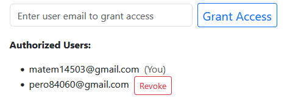
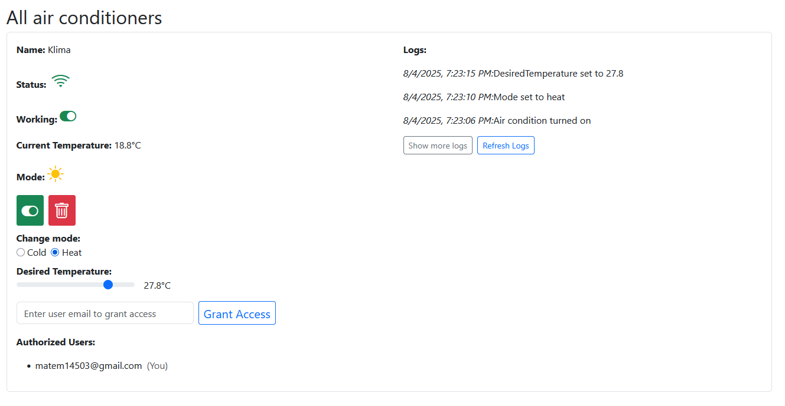
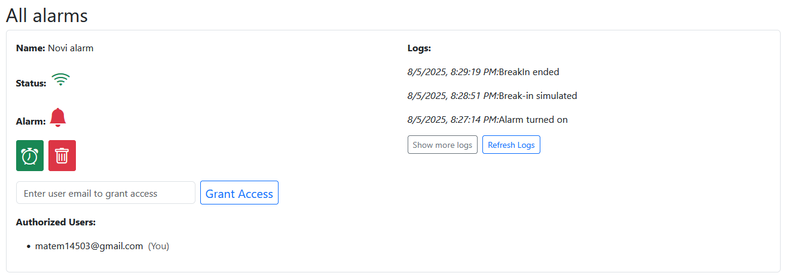
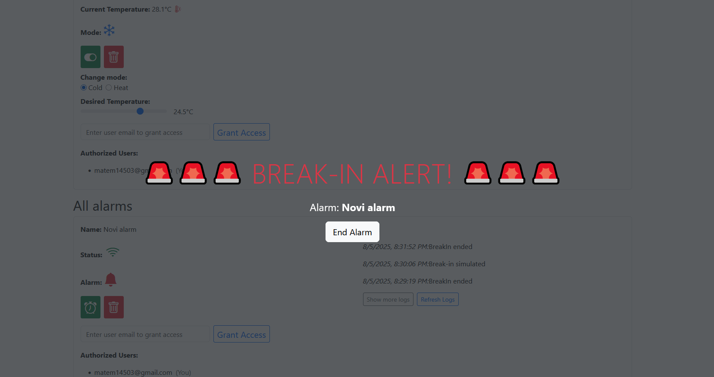
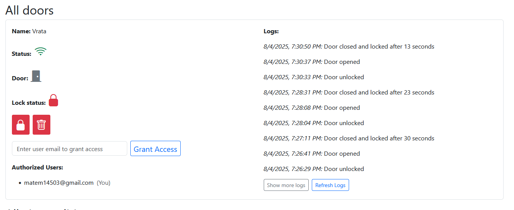

# Smart Device Management Web Application
This project is a full-stack web application for managing smart devices with real-time updates.
Devices are simulated in Spring Boot simulator, while frontend and backend are separate applications connected through **Firebase Realtime Database**.

---

## Table of Contents
- [Project Structure](#project-structure)
- [Features](#features)
- [Technologies Used](#technologies-used)
- [API Endpoints](#api-endpoints)
  - [User Endpoints](#user-endpoints)
  - [Door Endpoints](#door-endpoints)
  - [Air Conditioner Endpoints](#air-conditioner-endpoints)
  - [Alarm Endpoints](#alarm-endpoints)
- [Screenshots](#screenshots)
  - [Login](#login)
  - [SuperAdmin Interface](#superadmin-interface)
  - [Admin Interface](#admin-interface)
  - [User Interface](#user-interface)
  - [Access](#access)
  - [Air Condition](#air-condition)
  - [Alarm](#alarm)
  - [Break-in](#break-in)
  - [Door](#door)

---

## Project Structure 
- **frontend/** -> React application (user interface, Google login, managing devices)
- **backend/** -> Spring Boot application (REST API, authentication,access control)
- **simulator/** -> Java Spring Boot application (simulates smart devices:air conditions, doors, alarms)

---

## Features
- Google Sign-In authentication using Firebase
- Role-based access: **SuperAdmin**, **Admin**, **User**
- Real-time device management using Firebase Realtime database
- Device simulation:
    - **Door**: door opens randomly when unlocked, they close/auto-lock at random
    - **Alarm**: random break-in events
    - **Air Condition**: gradual heating/cooling to achieve target temperature
- Logging system for all simulated device events
- Client-based access management (Admins grant/revoke access)

---

## Technologies Used
- **Backend:** Java, Spring Boot, Firebase Admin SDK
- **Frontend:** React, Bootstrap, Firebase Auth & Database
- **Simulator:** Java, Spring Boot, Firebase Database
- **Database:** Firebase Realtime Database

---

## Database Structure (Firebase Realtime Database)

The application uses **Firebase Realtime Database** to store users, devices, access permissions, and logs.  
Data is stored in a tree-like JSON structure with the following main nodes:

| Node                 | Fields / Structure                                                                 | Description |
|----------------------|------------------------------------------------------------------------------------|-------------|
| **users**            | `uid`, `displayName`, `email`, `role` (USER / ADMIN / SUPERADMIN), `client`        | Stores all registered users with role and organization |
| **door**             | `id`, `name`, `client`, `ownerUid`, `locked`, `open`, `lastPing`, `logs[]`        | Stores door devices, their current state, and logs |
| **alarm**            | `id`, `name`, `client`, `ownerUid`, `isWorking`, `breakIn`, `lastPing`, `logs[]`  | Stores alarms, their state, break-in status, and logs |
| **airCondition**     | `id`, `name`, `client`, `ownerUid`, `isWorking`, `mode` (heat/cold), `currentTemperature`, `desiredTemperature`, `lastPing`, `logs[]` | Stores air conditioners and their states |
| **door_users**       | `<doorId>/<uid>: true`                                                            | Mapping of users who have access to a specific door |
| **alarm_users**      | `<alarmId>/<uid>: true`                                                           | Mapping of users who have access to a specific alarm |
| **airCondition_users** | `<acId>/<uid>: true`                                                            | Mapping of users who have access to a specific AC |
| **clients**          | `<clientName>/<email>: true`                                                      | Defines clients and their members |

---

## API Endpoints

All requests must include a valid **Firebase Token** in the `Authorization` header:

### User Endpoints
| endpoint             | description             | method |
|----------------------|-------------------------|--------|
| /user/login          | Create/login user       | POST   |
| /user/delete         | Delete user             | DELETE |
| /user/all            | Get all users           | GET    |
| /user/make-admin     | Promote user to Admin   | POST   |
| /user/assign-client  | Assign user to client   | POST   |

---

### Door Endpoints
| endpoint             | description             | method |
|----------------------|-------------------------|--------|
| /doors               | Create new door         | POST   |
| /doors/{id}          | Delete door             | DELETE |
| /doors/{id}/lock     | Lock door               | POST   |
| /doors/{id}/unlock   | Unlock door             | POST   |
| /doors/{id}/grant    | Grant access to user    | POST   |
| /doors/{id}/revoke   | Revoke access from user | DELETE |

---

### Air Conditioner Endpoints
| endpoint                          | description              | method |
|-----------------------------------|--------------------------|--------|
| /airConditions                    | Create new AC            | POST   |
| /airConditions/{id}               | Delete AC                | DELETE |
| /airConditions/{id}/on            | Turn AC on               | POST   |
| /airConditions/{id}/off           | Turn AC off              | POST   |
| /airConditions/{id}/temperature   | Set desired temperature  | POST   |
| /airConditions/{id}/mode          | Set mode (heat/cold)     | POST   |
| /airConditions/{id}/grant         | Grant access to user     | POST   |
| /airConditions/{id}/revoke        | Revoke access from user  | DELETE |

---

### Alarm Endpoints
| endpoint             | description              | method |
|----------------------|--------------------------|--------|
| /alarms              | Create new alarm         | POST   |
| /alarms/{id}         | Delete alarm             | DELETE |
| /alarms/{id}/on      | Turn alarm on            | POST   |
| /alarms/{id}/off     | Turn alarm off           | POST   |
| /alarms/{id}/endBreakIn | Reset alarm after break-in | POST |
| /alarms/{id}/grant   | Grant access to user     | POST   |
| /alarms/{id}/revoke  | Revoke access from user  | DELETE |

---

## Screenshots
---
### Login

### SuperAdmin interface

### Admin interface

### User interface

### Access

### Air Condition

### Alarm

### Break-in

### Door

[Back to top](#-table-of-contents)